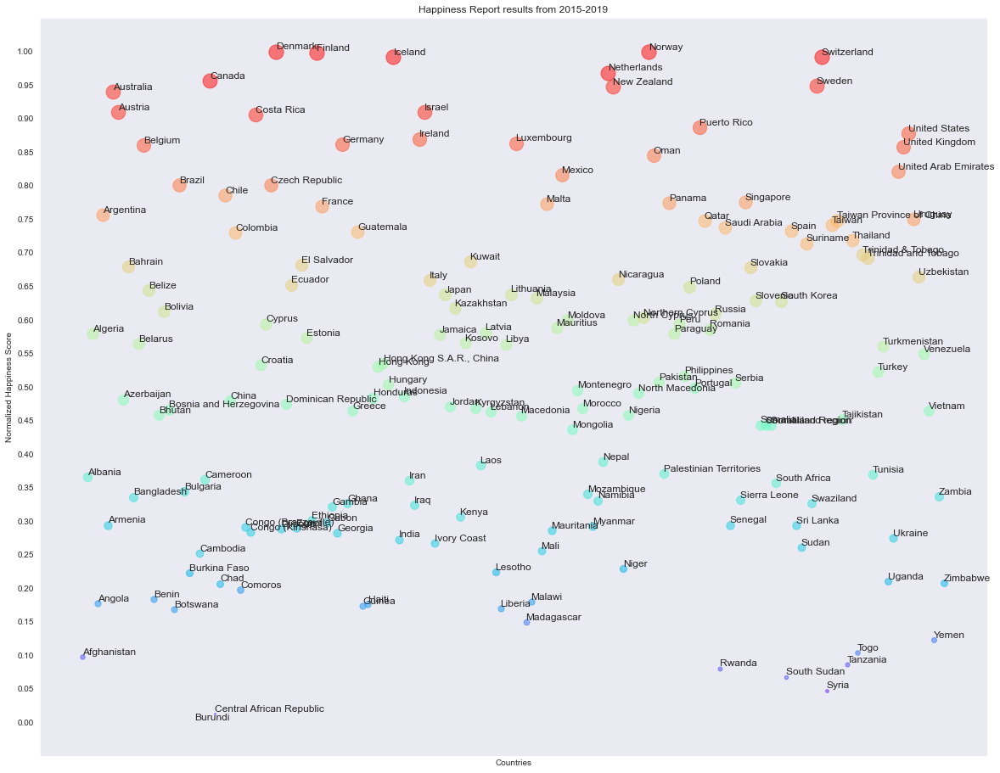

### Introduction

Happiness is this evasive feeling that people are in pursuit of constantly. I came across world happiness report somewhere on the web and I wanted to understand how is happiness measured. This report gives an overview about the happiness score of different countries around the world based the factors such GDP, Family, Life Expectancy, Freedom and Trust on Government. I was able to access this data on kaggle on this link [here](https://www.kaggle.com/unsdsn/world-happiness). There was data from the years 2015 till 2019. The nature of the data is also quite interesting since it's like a mini timeseries for each country. Based on this data I wanted to understand or answer these following questions based

1. What are happiest countries in the world?
2. What are common amongst these happy countries and What makes these countries happy?
3. Are there any anomalies amongst these happy countries?
4. What are the happiest countries in the making?
5. Is happiness obvious to predict?

### Happiest Countries in the World

