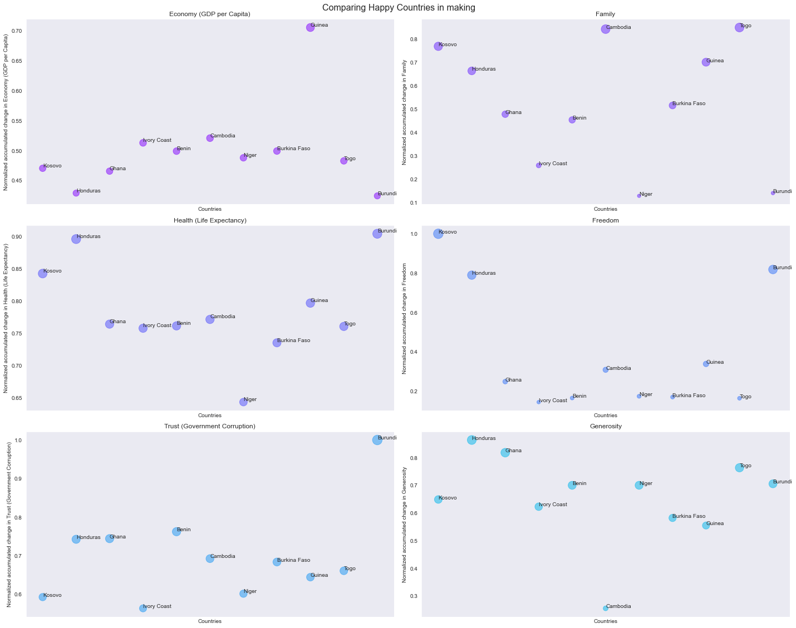
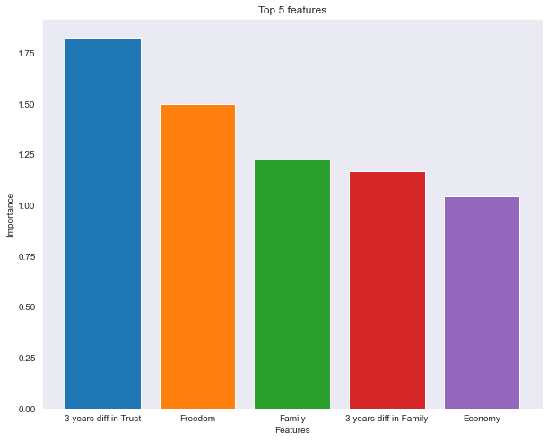

## 1. Introduction

Happiness is this evasive feeling that people are in pursuit of constantly. I came across world happiness report somewhere on the web and I wanted to understand how is happiness measured. This report gives an overview about the happiness score of different countries around the world based the factors such GDP, Family, Life Expectancy, Freedom and Trust on Government. I was able to access this data on kaggle on this link [here](https://www.kaggle.com/unsdsn/world-happiness). There was data from the years 2015 till 2019. The nature of the data is also quite interesting since it's like a mini timeseries for each country. The description of some of the important factors is mentioned below.

1. Trust (Government Corruption) - The extent to which Perception of Corruption contributes to Happiness Score
2. Family - The extent to which Family contributes to the calculation of the Happiness Score
3. Health (Life Expectancy) - The extent to which Life expectancy contributed to the calculation of the Happiness Score
4. Freedom - The extent to which Freedom contributed to the calculation of the Happiness Score
5. Generosity - The extent to which Generosity contributed to the calculation of the Happiness Score.
6. Economy (GDP per Capita) - The extent to which GDP contributes to the calculation of the Happiness Score

Based on this data I wanted to understand or answer these following questions

1. What are happiest countries in the world?
2. What are common amongst these happy countries and What makes these countries happy?
3. Are there any anomalies amongst these happy countries?
4. What are the happiest countries in the making?
5. Is happiness obvious to predict?

***

## 2. Happiest Countries in the World
Based on the data ranging from years 2015 to 2019, I tried to find which countries are the world's most happiest countries and the top 25 happiest countries in the world are as follows and list below is based arranged based on alphabetical order.

* Australia 
* Austria
* Belgium
* Brazil 
* Canada 
* Costa Rica
* Czech Republic 
* Denmark 
* Finland 
* Germany
* Iceland
* Ireland
* Israel
* Luxembourg
* Mexico
* Netherlands
* New Zealand
* Norway
* Oman
* Puerto Rico
* Sweden
* Switzerland
* United Arab Emirates
* United Kingdom
* United States

Also the countries are clustered with unique color code using happiness range and also the size of each data point corresponds to the normalized happiness score across multiple years. These countries mentioned above were on top of the list for consecutive years on an average. I further wanted to understand the qualities or factors that were common amongst all the happy countries.

***

## 3. Common Trends and Anomalies in Happy Countries

Based on the countries mentioned above I tried to compare them based Economy, Family, Health, Freedom, Trust on Government and Generosity to look for some common trends.

Based on the above plots not including the anomalies all the happiest countries have a common trend of high GDP, high life expectancy, high freedom, high trust on the goverment and some aspect of generosity. One of the most important factors seems to be Family with some exceptions to it. Countries like Brazil, Costa Rica and Mexico have very unusual behavior. They have very low GDP, freedom and trust on government compared to other happy countries. But also in the countries like Brazil and Costa Rica family palys are very important role in happiness. In countries like mexico an assumption can be made that people just choose to be happy no matter the circumstances and for some countries like Brazil and Costa Rica family plays a vital role. Thus for some countries happiness is a choice where as for some it comes with freedom, security and family.

***

## 4. Happy Countries in the Making

It is also beneficial to look at which countries are happy countries of tomorrow. Thus I looked for countries which were quickly climbing the happiness ladder based on their rank over consecutive years and it gave me very interesting insights.

Top 10 happy countries in the making are Kosovo, Honduras, Ghana, Ivory Coast, Benin, Cambodia, Niger, Burkina Faso, Guinea, Togo, Burundi based on the trend. But this list doesn't also give the complete picture since there are already countries on the top and these countries were in the bottom of the list and the scope of improvement in these countries is also quite high. Also, one of the other common observations was that the scope for improvement saturates after reaching certain threshold and this could be seen in the countries which are already happy like Australia, Austria, Belgium, Canada, Czech Republic, Denmark, Finlan, Germany, Iceland, Ireland, Israel, Luxembourg, Mexico, Netherlands, New Zealand, Norway, Oman, Puerto Rico, Sweden, Switzerland, United Arab Emirates, United Kingdom, United States.

Another trend which could be seen happy countries in making is that Family and life expectancy play a very important role. Thus at this point we can safely hypothesize that family and life expectancy play a very important role in happiness.

***

## 5. Predicting Happiness

Based on observations from the data, my hypothesis was that Family was very important for some countries to be happy where as for some it was Economy and Freedom. I tried to analyze how much these features contribute to the happines score and not surprisingly Freedom, Family and Economy where in the top 5 contributors to predicting happiness.

I've made all the code available on github [here](https://github.com/saikirankannaiah/pursuit_of_happiness). Pull requests are welcome!